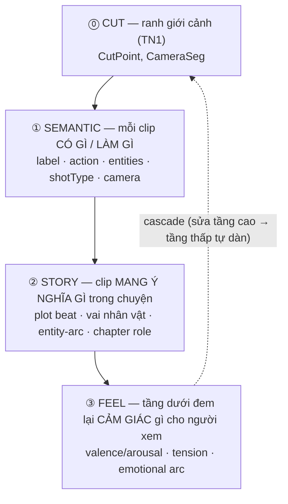
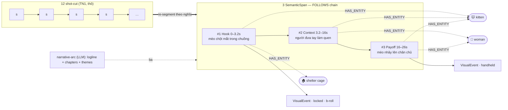
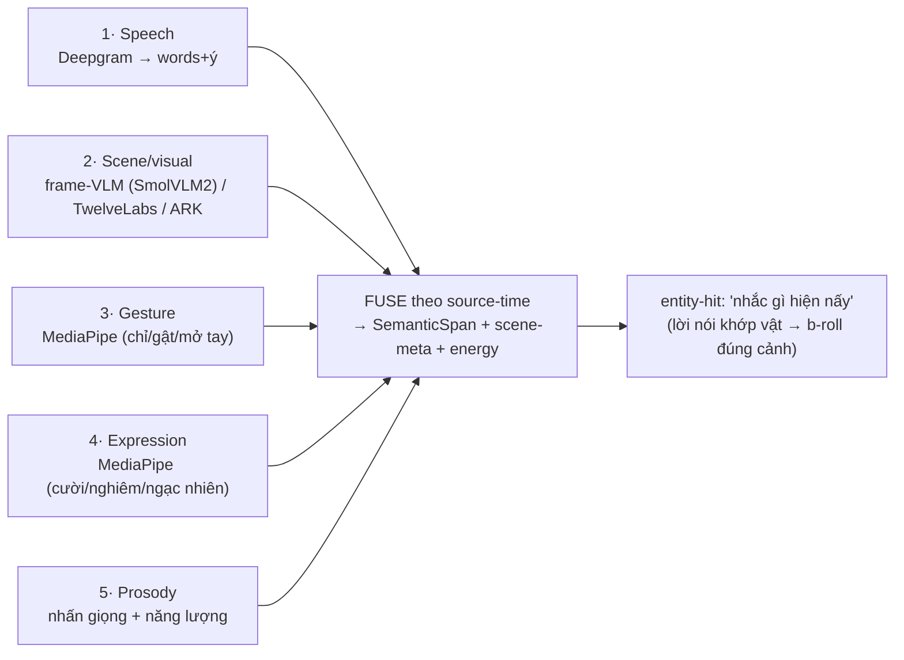
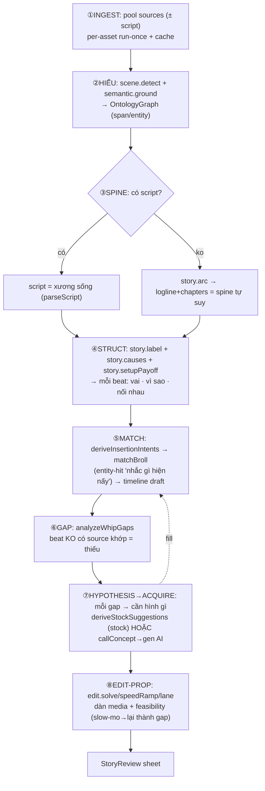
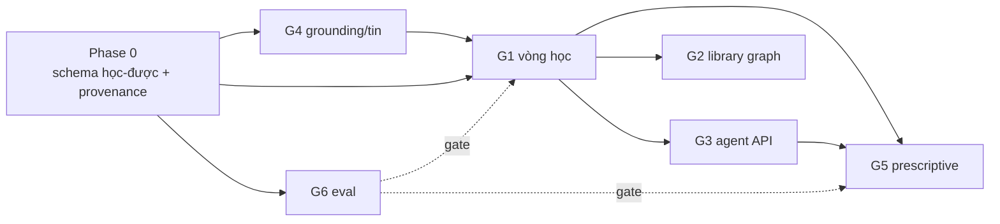

import Tabs from '@theme/Tabs';
import TabItem from '@theme/TabItem';

# Tính năng 2 — Temporal graph 4 TẦNG (Cut → Semantic → Story → Feel)

**Mục đích:** graph thời gian KHÔNG phẳng — **4 tầng chồng**, mỗi tầng hiểu sâu hơn tầng dưới, có **schema riêng**.
Chính là 4 tầng của panel timeline (`whip-levels.md`): panel = cách NHÌN, đây = DATA/SCHEMA cho mỗi tầng.



| Tầng | Hiểu cái gì | Đơn vị | Cách tính | Mục con |
|---|---|---|---|---|
| **⓪ Cut** | cảnh chia ở đâu | `SceneCutResult` | TransNetV2 (TN1) | → `whip-core-scenecut` |
| **① Semantic** | mỗi clip riêng lẻ: quay gì, làm gì, ai/vật, máy chuyển sao | `SemanticSpan.scene` | 5-layer fusion (VLM+MediaPipe+speech+prosody) | **2a** |
| **② Story** | clip này đóng vai gì trong CHUYỆN: plot beat, nhân vật, entity nào dẫn dắt | `StoryBeat` + `Character` + `narrative-arc` | LLM macro đọc toàn bộ span → chapters/role/coref | **2b** |
| **③ Feel** | chuỗi tầng dưới tạo CẢM XÚC gì cho người xem | `AffectPoint` (VAD) | `conditionTrajectory` + prosody + arc shape | **2c** |
| **↕ Edit** | sửa 1 beat → mọi media re-flow đúng nghĩa | `Constraint` + `TimeWarp` | constraint solver (Cassowary/Auto Layout) | **2d** |

> **Đọc bảng "Đạt SOTA chưa?" thế nào:** ✅ = đã có trong code + đúng cách SOTA · 🟡 = hướng đã đúng SOTA nhưng
> CHƯA code (ghi rõ hiện đang làm tạm gì) · ❌ = chưa làm / còn dưới SOTA. Cột "Whip làm gì" cố tình nói tiếng người.

---

## 2a — Tầng SEMANTIC — mỗi clip CÓ GÌ / LÀM GÌ

> Mục đích: mỗi **đơn-vị-nghĩa** → quay gì / ai / vật / nói gì + role; nối thành graph thời gian, neo source-time.
> 3 phần con: **2a1** ranh-giới-theo-nghĩa · **2a2** hiểu cảnh (5-layer fusion) · **2a3** cross-modal binding.

### 2a1 — Shot → đơn-vị-nghĩa (semantic re-segmentation)

> **Sửa chỗ bất ổn (Phong 20/06):** trước đây semantic buộc cứng **1 cảnh-cut = 1 span**. Sai, vì
> **ranh giới cut ≠ ranh giới nghĩa**: (a) cắt băm nhuyễn → nhiều micro-shot cùng 1 ý; (b) 1 take dài chứa nhiều ý;
> (c) shot quá ngắn "chỉ còn 1 chủ thể" → vô nghĩa. → cut chỉ là **ứng viên ranh giới**, phải **re-segment theo nghĩa**.

**Luồng (đã sửa):**
1. TN1 cho `sceneBounds[]` = **candidate boundaries** (gợi ý), KHÔNG phải đơn-vị-nghĩa cuối.
2. `segmentSemanticUnits(bounds, words, frameFeats)` — re-segment (cut là cấu trúc HÌNH, không xoá đi):
   - **GỘP** dãy shot liền nhau cùng chủ thể/chủ đề (đo bằng embedding hình + không có topic-shift lời nói) thành
     **1 đơn-vị-nghĩa CHA**, các shot con vẫn giữ nguyên bên dưới. Montage cắt nhanh = NHIỀU shot nhưng 1 ý → 1 unit
     cha, ko phá nhịp dựng. (Shot ngắn thường CỐ Ý — punchy/J-L cut — nên gom vào ý, KHÔNG bỏ.)
   - **TÁCH** take dài tại điểm nghĩa đổi (topic-shift lời nói + thay đổi hình lớn → embedding-based segmentation) → 1 take = nhiều ý.
3. Mỗi đơn-vị-nghĩa → `groundScenesTemporal(url, unit, {onPartial})`: VLM (WebGPU local / cloud) đọc frame đại diện → `SceneSeg`.
4. `onPartial` trả **DẦN** từng unit xong (stream, không đợi hết).
5. `scenesToGraph(SceneSeg[])` → `OntologyGraph`: mỗi unit = **1 VisualEvent + 1 SemanticSpan**.
6. **Entity coref** (`graphEntity.entitiesSame`): gộp "gray kitten" qua các unit thành 1 node → edge `HAS_ENTITY`.
7. Nối **FOLLOWS** giữa span liền nhau (continuity = temporal).
8. `conditionTrajectory` arc cảm xúc + `narrative-arc` (LLM) → logline + chapters + themes + editorNote.
9. → `TemporalNode[]` để hiển thị (mỗi mốc neo **source-time** → bền khi cut/move).

**Graph sinh ra (ví dụ video con mèo 26s — sau re-segment: 12 micro-shot → 3 đơn-vị-nghĩa):**



**SOTA & trạng thái (2a1):**

| Khía cạnh | SOTA-2026 (chuẩn ngành) | Whip làm gì (tiếng người) | Đạt SOTA chưa? | Operator (code) |
|---|---|---|---|---|
| Cắt cảnh thô | đang dùng [TransNetV2](https://arxiv.org/abs/2008.04838) (2020); **SOTA mới hơn = [AutoShot, CVPR 2023](https://arxiv.org/abs/2304.06116)** (NAS, hơn TransNetV2 ~+4.2% F1 trên short-video) | Dùng TransNetV2 tìm điểm chuyển cảnh, làm "ứng viên" ranh giới | ✅ có code; ⏫ nên nâng lên AutoShot cho short-form (đúng định dạng Whip) | **`scene.detect`** ✅ (pool/TL, 1/n clip) |
| Gộp dãy shot thành 1 ý (cha) | [BaSSL](https://arxiv.org/abs/2201.05277) (shot→scene self-sup), [Optimal Sequential Grouping](https://arxiv.org/abs/2205.08249) (DP gom shot thành scene) — *cả 2 đều giữ shot làm con, chỉ nhóm lại* | Gom dãy shot cùng chủ thể/chủ đề (Jaccard túi entity+nhãn, so theo NGỮ CẢNH unit) thành 1 unit-cha; shot tí hon hút vào, ko bỏ (montage = 1 ý) | ✅ **code + WIRE** `segmentSemanticUnits` (selftest 6/6); **nối vào `longFootageIndex` 22/06** — trước đó hàm có nhưng path "Hiểu cảnh" đi thẳng `assignSceneBounds` → clip dài (2 frame mẫu) bị **chẻ nửa thành 2 span** (sai §2a1). Giờ ground xong → re-segment → 1 span/đơn-vị-nghĩa, phủ trọn clip. | **`semantic.resegment`** ✅ (auto) · `scene.groupShots` ✅ (chọn tay) |
| Tách 1 take dài thành nhiều ý | [Multi-Level Transcript Segmentation (2026)](https://arxiv.org/abs/2601.02128) (chia transcript theo chủ đề), [Streaming Dense Video Captioning (CVPR 2024)](https://arxiv.org/abs/2404.01297) (caption theo sự-kiện, ko theo shot) | Cắt cảnh dài tại VALLEY cohesion lời nói (TextTiling-lite trượt cửa sổ Jaccard) | ✅ **code rồi** `splitLongUnit` (cần transcript trong cảnh) | `scene.splitTake` ✅ |

**Definition of Done — 2a1** (so paper + UI + edge):
- ☑ **Khớp paper:** gom shot→scene đúng kiểu BaSSL/OSG (nhóm theo ngữ cảnh, giữ con); selftest 6/6 (2 unit đúng, ranh giới khít, sim mèo>0.3 vs người dưới 0.2). TÁCH = TextTiling-lite (valley cohesion) như topic-seg.
- ☑ **UI update có ích:** chạy → `setTemporalNodes` → pill semantic **gom lại / tách ra thấy ngay** trên track (bớt pill vụn 1-chủ-thể).
- ☑ **Edge:** chưa 'Hiểu cảnh' → báo rõ; dưới 2 shot → bỏ qua; tách mà ít lời nói/ko valley → giữ nguyên + báo.
- ☐ **Còn:** dùng embedding hình thật (giờ Jaccard text-túi) để gộp nhạy hơn khi nhãn nghèo — nâng sau khi có frame-embed.

→ **Vì sao đáng làm:** không NLE/Descript nào re-segment theo NGHĨA — họ giữ nguyên cut. Whip nhóm shot-cut (đơn-vị HÌNH) thành *đơn-vị-nghĩa* mà ko phá nhịp dựng = nền cho Story/Feel đúng. (Khớp đúng bài toán shot-to-scene của BaSSL/OSG.)

### 2a2 — Hiểu cảnh: 5-LAYER FUSION (KHÔNG 1 model)

Hiểu nghĩa = trộn 5 nguồn, mỗi nguồn mạnh 1 thứ, fuse theo source-time. Không model đơn nào đủ — đây là cái làm
nên "semantic temporal THẬT".



**Chọn model layer 2 (visual) — benchmark & trade-off:**

| Model | Hiểu temporal | Độ chính xác | Chạy đâu | Chi phí/Perf | Whip dùng |
|---|---|---|---|---|---|
| **TwelveLabs** | ✅ video-native (cả đoạn) | ★★★ (gốc so sánh) | cloud, có key `VITE_TWELVELABS_API_KEY` | API call/video, chậm hơn | khi cần hiểu temporal sâu |
| **Frame-VLM** (SmolVLM2 browser / ARK seed-1-6) | 🟡 per-frame, ghép | **≈90% TwelveLabs** | **browser (WebGPU)** / cloud rẻ | nhẹ, lazy+cache, no-upload | **mặc định** (Moat #2) |
| **MediaPipe** | ❌ (frame) | — | browser | rất nhẹ | **layer 3+4** (gesture/expression granular — TwelveLabs ko có) |

→ Chiến lược: **frame-VLM mặc định** (90% chất lượng, local, rẻ) + **MediaPipe** cho cử chỉ/biểu cảm (chỗ
TwelveLabs thua) + **TwelveLabs** bật khi cần temporal sâu. Mọi quyết định eval MB/decode/inference TRƯỚC (browser-tradeoff).

**Ví dụ: bỏ video con mèo 26s vào → mỗi model phân tích ra gì** (cùng cảnh #1, 0–3.2s):

<Tabs>
<TabItem value="vlm" label="Frame-VLM (mặc định)" default>

```json
// sample ~2 frame/cảnh → SmolVLM2/ARK → ghép per-cảnh
{
  "scene": 1, "t": "0.0–3.2s",
  "label": "Chú mèo xám-trắng chột một mắt nằm trong chuồng sắt",
  "shotType": "b-roll", "entities": ["shelter cage", "blanket", "newspapers"],
  "identities": ["gray-white kitten"], "camera": "locked",
  "confidence": 0.88   // ≈90% TwelveLabs, chạy browser, ~vài trăm ms/cảnh
}
```

</TabItem>
<TabItem value="12l" label="TwelveLabs">

```json
// đọc CẢ ĐOẠN (video-native) → temporal mạnh hơn, bắt diễn biến trong cảnh
{
  "scene": 1, "t": "0.0–3.2s",
  "label": "Mèo chột mắt nằm im trong chuồng, thở nhẹ, hơi rúc vào chăn",
  "temporal": "mèo ban đầu nằm yên → cuối cảnh ngẩng đầu nhẹ",
  "entities": ["cage","blanket"], "confidence": 0.95,
  "note": "cloud API, chậm hơn + tốn key — bật khi cần temporal sâu"
}
```

</TabItem>
<TabItem value="mp" label="MediaPipe (layer 3+4)">

```json
// KHÔNG hiểu 'mèo' — nhưng granular cử chỉ/biểu cảm theo frame (TwelveLabs ko có)
{
  "scene": 1, "gestures": [], "expressions": [],
  "note": "cảnh b-roll mèo → MediaPipe ít tín hiệu. Mạnh ở cảnh talking-head:",
  "talkingHeadExample": { "t": "12.0–12.4s", "gesture": "pointing", "expression": "smile", "headMotion": 0.7 }
}
```

</TabItem>
<TabItem value="fused" label="★ FUSED (5-layer)">

```json
// Whip trộn 5 layer theo source-time → SemanticSpan giàu (cái thật sự dùng)
{
  "id": "span_1", "start": 0.0, "end": 3.2, "kind": "broll",
  "label": "Chú mèo chột mắt trong chuồng cứu hộ",
  "scene": { "action": "mèo nằm yên rồi ngẩng đầu", "shotType": "b-roll",
             "identities": ["gray-white kitten"], "entities": ["shelter cage","blanket"],
             "camera": "locked", "intent": "Mở bằng tổn thương → kéo đồng cảm" },
  "energy": 0.35,
  "keywords": ["kitten","cage","shelter"]
}
```

</TabItem>
</Tabs>

**SOTA & trạng thái (2a2):**

| Khía cạnh | SOTA-2026 | Whip làm gì (tiếng người) | Đạt SOTA chưa? | Operator (code) |
|---|---|---|---|---|
| Hiểu hình trong cảnh | [SmolVLM2](https://arxiv.org/abs/2504.05299) / [SigLIP 2 (2025)](https://arxiv.org/abs/2502.14786) / [LLaVA-OneVision (2024)](https://arxiv.org/abs/2408.03326) (VLM đọc khung hình); TwelveLabs (tool video-native, đọc cả đoạn) | frame-VLM (BytePlus seed-1-6 multimodal) đọc cảnh → nhãn + entity + shotType | ✅ **verify LIVE**: frame kitten thật → "Kitten on blanket over newspapers" + entities chính xác | **`semantic.ground`** ✅ · **`semantic.regenerate`** ✅ |
| Cử chỉ (tay) | [MediaPipe Hands](https://arxiv.org/abs/2006.10214) (hand-landmark theo khung) | Sample frame → đếm ngón → fist/pointing/open-palm/peace/N-fingers | ✅ **code** (`@mediapipe/tasks-vision` đã cài + wired; heuristic selftest 7/7; model tải CDN lần đầu) | **`gesture.detect`** ✅ |
| Biểu cảm (mặt) | [BlazeFace + Face Mesh](https://arxiv.org/abs/1907.05047) (face-landmark theo khung) | Face blendshapes → smile/surprised/serious/neutral | ✅ **code** (MediaPipe FaceLandmarker; selftest 7/7) | **`expression.detect`** ✅ |
| Trộn nhiều nguồn | [Late-fusion cross-modal DVC 2025](https://www.mdpi.com/1424-8220/25/3/707) | Gộp 5 nguồn (speech+VLM+gesture+expression+prosody) theo mốc thời gian | 🟡 từng nguồn ✅ riêng (VLM live, gesture/expr code); **hợp nhất 5→1 span** còn 1 phần | (gộp trong `semantic.ground`) 🟡 |
| Khớp lời ↔ vật | open-vocab detection + coreference | "Nhắc gì hiện nấy": nói "shelter" → ưu tiên b-roll có chuồng | ✅ Đã có (`graphEntity`) | **`entity.coref`** ✅ |

→ **Vì sao đáng làm:** đối thủ chỉ 1 nguồn (Descript=transcript, Runway=tag). Whip fuse 5 nguồn ngay trong browser → hiểu cảnh sâu mà KHÔNG upload (Moat #2).

#### 2a2.x — COARSE → FINE (chính xác theo nhu cầu, cost có kiểm soát)

**Vấn đề:** `semantic.ground` (auto, dùng trong Whip It nền) cap **~96 cảnh/asset** để chặn token VLM cloud
(`longFootageIndex.ts` maxFrames, 1 frame/cảnh temporal). Footage **>96 cut** (montage / rất dài) → cảnh ngoài
mẫu KHÔNG có nhãn → match/hiểu thiếu chính xác. Cap hợp cho chạy nền tự động, **không hợp** khi user chủ động
muốn hiểu kỹ 1 cảnh.

**Quyết định (22/06):** tách 2 tầng hiểu — field `TemporalNode.depth = "coarse" | "deep"`:

| Tầng | Khi nào | Cách | Cost | Trạng thái |
|---|---|---|---|---|
| **Coarse** | auto (Whip It nền) | scene-cut CẢ video (TransNetV2, ko cap) + VLM cloud 1 frame/cảnh, cap ~96 rải đều | bounded (cap + cache) | ✅ `semantic.ground` |
| **Fine (on-demand)** | user bấm / cảnh script cần | VLM cloud SÂU đúng cảnh nhắm: nhiều frame temporal (fps 5), KHÔNG cap | chỉ vài cảnh × dày → rẻ | ✅ **`semantic.deepScene`** ("Hiểu sâu cảnh này") |
| **Coarse-local (Stage 2)** | auto, MỌI cut, thay tầng coarse cloud | embedding **CLIP ViT-B/16** in-browser (transformers.js WebGPU, dep `@huggingface/transformers` ĐÃ có) 1 frame/cut → nhãn zero-shot + **substrate retrieval** (lời thoại→frame) | ~free, local (Moat #2) | 🟡 **CỔNG ĐO ĐÃ QUA** (22/06, máy Phong, `scripts/measure-siglip.mjs`): WebGPU OK · **CLIP ViT-B/16 = 58ms/frame, dim 512 pooled, cold-load ~7s** (gồm download ~340MB, cache sau) · SigLIP base p16 = 64ms nhưng trả token-grid (cần pool) → **chọn CLIP ViT-B/16**. 200 cut ≈ 12s nền, chấp nhận. Lazy+cache(IndexedDB)+bounded. **CHƯA wire vào pipeline.** |

> **Đo thật** (`src/dev/measureSiglip.ts` + `scripts/measure-siglip.mjs`, Playwright headed Chrome): WebGPU available=true.
> CLIP ViT-B/16 pooled 512-dim @58ms/frame là lựa chọn coarse-local (SigLIP image-feature-extraction trả last_hidden_state
> 196×768 chưa pool → bỏ). So sánh ứng viên: [SmolVLM-256M](https://huggingface.co/blog/smolervlm) (caption, nặng hơn embedding) ·
> [FastVLM Apple](https://machinelearning.apple.com/research/fast-vision-language-models) (chưa có bản ONNX/transformers.js ổn).
> Embedding (ko phải caption) đủ cho coarse: zero-shot tag + retrieval — caption sâu để FINE cloud lo.

UI: band semantic deep hiện badge **🔍 sâu** (`cb-deep`); pulse `flashSemantic` khi deepScene xong. Retrieval/match
ưu tiên node `depth:"deep"`. Stage 2 nối với §assembly coarse-index (cùng embedding) → 1 substrate retrieval thống nhất.

### 2a3 — Cross-modal binding (hình ↔ chữ ↔ tiếng)

1 SemanticSpan là **anchor thời gian** mà MỌI modality gắn vào — không chỉ hình + speech. Editor thật nghĩ theo
cụm "ở đoạn này: thấy gì + chữ gì + nghe gì". Whip bind 6 modality vào span qua `OntoLink`, mỗi loại có **scope**
(đã bàn ở whip-levels) quyết hành xử khi cắt/lên tầng — và là **đầu vào cho constraint solver 2d**:

| Modality | Nguồn | Scope | Khi cắt/đổi chỗ | Lên tầng Story/Feel |
|---|---|---|---|---|
| Hình (visual) | VisualEvent / clip | scene | đi theo clip | thành "cảnh" |
| Voice-over / speech | Word (Deepgram) | scene | theo clip (anchor wordId) | thành "lời kể" của beat |
| Caption (phụ đề) | caption clip | scene | bám wordId → theo | gộp vào nội dung beat |
| Title / text-effect | graphic clip | scene/boundary | theo cảnh nó nhấn | thành "điểm nhấn" |
| SFX (hiệu ứng tiếng) | audio clip | **boundary** (1 hit) | dính mốc/động tác | gập đi (abstract) ở tầng trên |
| Nhạc nền | audio clip | **spanning** (xuyên suốt) | KHÔNG dời — re-time theo beat | thành "tông cảm xúc" nền (vào Feel) |

→ Khi reorder ở tầng Story: hình+voice+caption+title **đi theo beat** (anchor); SFX dính động tác; **nhạc re-time**
không nhảy. Đây là chỗ semantic graph + scope làm "smart-link" thật (2a4 bám nhẹ + 2d reflow đa-media) thay vì editor canh tay từng track.

**SOTA & trạng thái (2a3):**

| Khía cạnh | SOTA-2026 | Whip làm gì (tiếng người) | Đạt SOTA chưa? | Operator (code) |
|---|---|---|---|---|
| Gắn hình–chữ–tiếng vào nhau | NLE phải link tay từng track; Descript tự gắn caption vào lời | Neo media (caption/title/SFX/nhạc) vào beat-anchor theo **scope** (scene/boundary/spanning) + priority | ✅ **code** (`bindingRuntime` 2a3, selftest 8/8: beat move→caption bám, sfx dính mốc, nhạc re-time) | **`bind.crossModal`** ✅ |
| Re-time nhạc theo nhịp | [Beat This! (ISMIR 2024)](https://arxiv.org/abs/2407.21658) — beat-tracking SOTA (model); Whip dùng baseline energy-flux | Decode Web Audio → onset/BPM (selftest: click 0.5s → 8 onset, 120 BPM) → để snap/re-time theo phách | ✅ **code** DSP (`audioBeat`, selftest 4/4); ⏫ nâng model Beat This sau; áp re-time = 2d | **`audio.retimeMusic`** ✅ |
| Khớp SFX với động tác | audio onset detection (energy-flux cổ điển) | Decode → các điểm gõ (onset) để snap SFX vào | ✅ **code** (`detectOnsets`); áp snap = 2d | **`audio.syncSfx`** ✅ |

→ **Vì sao đáng làm:** NLE coi mỗi track độc lập, đổi 1 cái phải canh tay phần còn lại. Whip neo tất cả vào 1 đơn-vị-nghĩa → đổi beat thì cả cụm media đi cùng đúng vai.

### Schema tầng Semantic

<Tabs>
<TabItem value="iface" label="Interface" default>

```ts
// schema/ontology.ts — SemanticSpan ĐẦY ĐỦ (Moat #1). KHÔNG chỉ label — giàu scene-meta + recommend.
interface SemanticSpan {
  id: string; assetId: string;
  start: number; end: number;        // SOURCE-time (anchor bền qua cut)
  label: string;
  kind: string;                      // talking: intro|point|story|aside|conclusion|energy-peak|callout · broll
  summary?: string; keywords: string[];  // keywords để match cross-modal (broll ↔ speech)
  energy: number;                    // 0..1
  wordIds: string[];                 // Word PART_OF span (query nhanh)
  source: "ai" | "heuristic" | "manual";
  recommend?: { type: "broll" | "graphic" | "speaker"; detail: string };  // gợi ý dựng/đoạn
  scene?: {                          // data VLM đã đọc — giàu như sample
    action?: string;                 // hành động đang diễn ra
    shotType?: string;               // talking-head | b-roll | graphic
    identities?: string[];           // người (main/other + appearance)
    entities?: string[];             // vật thể
    camera?: string;                 // locked | smooth-move | handheld (ĐO)
    onScreenText?: { content?; position?; size?; style?; color?; animation? } | null;
    intent?: string;                 // Ý NGHĨA cảnh KỂ gì (story role) — ko chỉ mô tả
  };
}
// VisualEvent — perception layer (nhiều kind, từ nhiều model fusion)
interface VisualEvent { id; assetId; start; end; kind: "scene"|"face"|"gesture"|"pose"|"object"; tags: string[]; summary?; confidence: number; source: string }
// Entity (coref toàn graph) + OntoLink (cạnh: PART_OF / FOLLOWS / HAS_ENTITY / ANCHORED_TO / ILLUSTRATES)
interface OntologyGraph { words: Word[]; visuals: VisualEvent[]; spans: SemanticSpan[]; entities: Entity[]; links: OntoLink[]; ingested: string[] }
```

</TabItem>
<TabItem value="ex" label="Ví dụ">

```json
{
  "id": "span_1", "assetId": "asset_scrunch", "start": 0.0, "end": 3.2,
  "label": "Chú mèo bị chột một mắt nằm trong chuồng sắt", "kind": "broll",
  "keywords": ["kitten","cage","shelter"], "energy": 0.35, "source": "ai",
  "scene": {
    "action": "mèo nằm yên rồi ngẩng đầu", "shotType": "b-roll",
    "identities": ["gray-white kitten"], "entities": ["shelter cage", "blanket"],
    "camera": "locked", "intent": "Mở bằng tổn thương → kéo đồng cảm"
  }
}
```

</TabItem>
</Tabs>

### 2a4 — Hiển thị (HUD callout) + bám source-time khi edit

> *(Trước đây tách thành "Tính năng 3/4" — thực ra chỉ là phần HIỂN THỊ + BÁM của tầng Semantic, gộp về đây.)*
> Edit-propagation đa-media nặng (warp/ripple/reorder nhiều lớp) nằm ở **2d**; ở đây chỉ là **callout semantic tự bám clip**.

**Hiển thị — HUD callout (KHÔNG phải pill cục):** mỗi đơn-vị-nghĩa render thành **callout kiểu game HUD** — chữ mô tả
+ gradient glow theo `energy` + fade-in mượt khi stream vào, neo trên đúng đoạn.
1. Track semantic đọc `temporalNodes`. 2. Mỗi node → `semSrcToTl(srcAsset, start, end)` ra vị trí timeline (x theo clip hiện tại).
3. Vẽ callout (nền gradient mờ + viền glow màu function + fade-in). 4. Mật độ chữ theo bề rộng: rộng = full câu, hẹp = rút gọn.

**Bám khi edit (smart-link nhẹ):** `start/end` lưu **source-time** → cắt/kéo/trim clip thì `semSrcToTl` tính lại LIVE
→ callout tự bám. Cảnh bị cắt mất → ẩn. Đoạn còn quá hẹp → **LOD** rút label còn chủ thể chính; cắt vụn quá → cảnh báo "vỡ nghĩa".
Đổi chỗ clip → callout đi theo (cùng anchor) = "auto sort" ko canh tay. *(Đa-media đi cùng = 2d.)*

**UI/UX:** text đọc-là-hiểu > icon mã hoá. **Gaze:** mắt bám chuyển-động+tương-phản → glow+fade-in hút đúng cảnh, ko loãng.
**Color:** màu theo function nhất quán → nhận diện pre-attentive. **Motion = object constancy** (Heer&Robertson): callout
trượt/fade mượt khi cắt → não giữ "vẫn cảnh đó". **LOD** (details-on-demand, Shneiderman).

**Schema (đơn vị hiển thị):**

```ts
// schema/project.ts — TemporalNode = SemanticSpan đã chiếu xuống đơn vị render trên track
interface TemporalNode {
  id: string; start: number; end: number; label: string;
  type: string;            // function vai (hook|proof|cta|context...) → màu callout
  energy: number;          // 0..1 → cường độ glow + heatmap Feel
  caption?: { summary?: string; topic?: string; sentiment?: number; keywords?: string[] };
  direction?: { footage?: string; effect?: string };
  srcAsset?: string;       // set → start/end = SOURCE-time (anchor bền qua cut) = mấu chốt bám
}
```

**File:** `components/Timeline.tsx` (`.tl-semantic`, `semSrcToTl`/`semTlToSrc`), `engine/anchors.ts`.
**Trạng thái:** ✅ bám source-time + **HUD callout** (gradient glow theo led + fade-in `sem-callout-in`, CSS `.clip-kind-semantic`) — verified E2E screenshot. 🟡 còn: LOD collapse khi quá hẹp + animate trượt khi drag.

---

## 2b — Tầng STORY — clip MANG Ý NGHĨA GÌ trong chuyện

> Semantic chỉ hiểu **mỗi clip riêng lẻ**. Story đọc TOÀN BỘ span (LLM macro) → mỗi clip đóng vai gì trong mạch:
> plot đang ở đâu, nhân vật nào, beat này **cài/trả** gì, **gây ra** beat nào.

**Luồng:**
1. Gom các SemanticSpan liền-vai → `StoryBeat` (1 ý kể = 1 beat, ko phải mỗi câu).
2. LLM macro điền `function` (OPEN-VOCAB) + `dramaticQuestion` + `motivation` + `plotState`.
3. Coref nhân vật toàn video → `Character` (ngoại hình → 1 người qua nhiều cảnh).
4. Suy quan hệ **nhân-quả** `causes[]` + **cài↔trả** `setupPayoff` giữa các beat.
5. `narrative-arc` (LLM): logline + chapters + themes + editorNote.
6. Map MỀM sang archetype library (`whip-archetype`) qua embedding — KHÔNG khoá enum.

**Anti-hardcode (Phong flag):** `function` là **free-text + embedding**, KHÔNG enum `setup|struggle|...`. SOTA
[Narrative Context Protocol 2025](https://arxiv.org/abs/2503.04844): narrative function là nhãn mở, map mềm. Hardcode enum = bóp méo tư duy editor.

**SOTA & trạng thái (2b):**

| Khía cạnh | SOTA-2026 | Whip làm gì (tiếng người) | Đạt SOTA chưa? | Operator (code) |
|---|---|---|---|---|
| Đặt tên vai cho cảnh | [Narrative Context Protocol](https://arxiv.org/abs/2503.04844) — nhãn vai mở (free-text + embedding), KHÔNG enum cứng | Map mỗi cảnh vào chương của mạch → ghi vai vào pill (đổi MÀU theo role) | ✅ **code** (`/api/narrative-arc`; cần key BytePlus runtime) | **`story.label`** ✅ |
| Dựng mạch tổng | LLM story structuring | logline + chương + themes từ chuỗi cảnh | ✅ **code** (`/api/narrative-arc`) | **`story.arc`** ✅ |
| Beat nào gây ra beat nào | [Event Causality Is Key to Story Understanding](https://arxiv.org/abs/2311.09648) | LLM đọc chuỗi cảnh → cảnh nào gây ra cảnh nào | ✅ **code+verify live** (`/api/story-relations`) | **`story.causes`** ✅ |
| Nhận chi tiết cài-cắm | [Chekhov's-Gun Recognition](https://deepai.org/publication/chekhov-s-gun-recognition) — nhận diện *chi tiết then chốt cho plot* | Ghép cặp cảnh cài↔cảnh trả (Whip mở rộng pairing trên paper NHẬN) | ✅ **code+verify live** (`/api/story-relations`) | **`story.setupPayoff`** ✅ |
| Nhận ra cùng 1 nhân vật | person re-id + coreference xuyên cảnh | LLM gom 1 nhân vật qua nhiều cảnh | ✅ **code+verify live** (`/api/story-relations`) | **`story.characters`** ✅ |

→ **Vì sao đáng làm:** đối thủ dừng ở transcript/tag. Whip suy được "beat này cài cây súng, beat kia bóp cò" + "vì sao beat tồn tại" — đúng tư duy biên tập.

**Definition of Done — 2b** (so paper + UI + edge):
- ☑ **Khớp paper + verify LIVE:** `/api/story-relations` (ARK) chạy thật trên ví dụ mèo → `causes` [mèo-thương→người-chạm→nhận-nuôi], `setupPayoff` [chạm→nhận-nuôi], `characters` [kitten, woman] — đúng event-causality + Chekhov + coref. `story.arc`/`story.label` qua `/api/narrative-arc` (verify live: logline + chapters đúng).
- ☑ **UI update có ích:** `story.label` **đổi MÀU pill** theo vai (hook/turn/payoff); arc/causes/setupPayoff/characters báo kết quả trong HUD (arc-connector viz = việc sau).
- ☑ **Edge:** dưới 2 cảnh / chưa Hiểu cảnh → báo rõ; thiếu `ARK_API_KEY` → message graceful ko crash; LLM trả index sai → lọc bỏ (sanitize valIdx).
- ☐ **Còn:** render arc-connector (cung nối cài↔trả) trên tầng Story (data-viz, mục UI/UX 2b) — cần component mới.

**Schema tầng Story:**

<Tabs>
<TabItem value="iface" label="Interface" default>

```ts
// ── TẦNG ② STORY — OPEN-VOCAB, KHÔNG hardcode enum (narrative function = free-text + map mềm) ──
interface StoryBeat {
  id: string; spanIds: string[];          // gộp các SemanticSpan thành 1 beat
  function: string;                        // OPEN-VOCAB (LLM tự sinh): "introduce the wound","stack proof"... KHÔNG enum.
  archetypeRef?: { id: string; fit: number };  // map MỀM sang archetype library (whip-archetype) nếu khớp
  dramaticQuestion?: string;               // câu hỏi kịch tính beat mở ra ("liệu mèo có được nhận nuôi?")
  motivation?: string;                     // VÌ SAO cut/đặt ở đây (emphasis|continuity|rhythm|reveal)
  plotState?: string;                      // chuyện đang ở đâu (free-text)
  characterIds: string[];                  // nhân vật trong beat (ref Character)
  keyEntityIds: string[];                  // entity dẫn dắt beat
  embedding?: number[];                    // vector beat → cluster (open-vocab, ko phụ thuộc enum)
  causes?: string[];                       // beat này GÂY RA beat nào (event-causality)
  setupPayoff?: { role: "setup"|"payoff"; pairId: string };  // cài↔trả (Chekhov's-Gun)
}
interface Character {
  id: string; appearance: string;          // mô tả ngoại hình (coref qua cảnh)
  narrativeRole?: string;                   // OPEN-VOCAB: "protagonist"|"helper"|... free-text, ko khoá
  arc?: string; entityId: string;          // liên kết Entity người trong graph
}
// api/narrative-arc.ts (đã có): logline + chapters[] + themes[] + editorNote (role chapter cũng open-vocab)
```

</TabItem>
<TabItem value="ex" label="Ví dụ">

```json
{
  "beat": {
    "id": "beat_1", "spanIds": ["span_1"], "function": "introduce the wound",
    "dramaticQuestion": "liệu chú mèo có được nhận nuôi?",
    "motivation": "reveal", "plotState": "thiết lập nỗi đau",
    "characterIds": ["char_kitten"], "keyEntityIds": ["ent_cage"],
    "setupPayoff": { "role": "setup", "pairId": "adopt" }
  },
  "narrativeArc": {
    "logline": "Hành trình một chú mèo chột mắt từ chuồng cứu hộ về mái nhà ấm.",
    "themes": ["recovery", "trust", "home"],
    "chapters": [
      { "title": "Gặp gỡ", "start": 0, "end": 16, "role": "setup", "summary": "Mèo cô độc trong chuồng" },
      { "title": "Kết nối", "start": 16, "end": 40, "role": "turn", "summary": "Người đưa tay làm quen" }
    ]
  }
}
```

</TabItem>
</Tabs>

---

## 2c — Tầng FEEL — tầng dưới đem lại CẢM GIÁC gì cho người xem

> Story hiểu *chuyện*; Feel hiểu *chuỗi tầng dưới tạo CẢM XÚC gì cho người xem* — và đường **giữ chân** họ.
> Khung nền = **VAD dimensional continuous** (Valence-Arousal-Dominance), cảm xúc **evoked-in-viewer**, KHÔNG nhãn rời cứng;
> đo bằng SOTA-2026 multimodal ([Emotion-LLaMA, NeurIPS 2024](https://openreview.net/forum?id=qXZVSy9LFR)).

**Luồng:**
1. Mỗi mốc → `AffectPoint`: VAD (valence/arousal/dominance) từ label + prosody + arc shape.
2. `surprise` = lệch kỳ vọng (editor chơi với expectation khán giả).
3. `retention`/`reEngage` = đường giữ-chân (best-practice ngành creator: drop ~55% phút đầu, re-engage beat ~25%/65% — heuristic, cần học từ analytics thật để đúng).
4. Nối **saliency heatmap** → điểm hút mắt. Arc tổng = `AffectPoint[]` = đường "Cảm xúc" ở panel Levels.

**SOTA & trạng thái (2c):**

| Khía cạnh | SOTA-2026 | Whip làm gì (tiếng người) | Đạt SOTA chưa? | Operator (code) |
|---|---|---|---|---|
| Đo cảm xúc | SOTA-2026: [Emotion-LLaMA (NeurIPS 2024)](https://openreview.net/forum?id=qXZVSy9LFR) đa-modal + [survey Video Emotion Recognition 2025](https://pmc.ncbi.nlm.nih.gov/articles/PMC12197140/). *Trục VAD (valence/arousal/dominance) = khung nền* | Tính valence mỗi cảnh → arousal → **ghi glow (energy) vào pill** | ✅ **code** (`conditionTrajectory`→energy); 🟡 chưa chạy model VAD đa-modal thật | **`feel.trajectory`** ✅ (đổi glow) |
| Bất ngờ / lệch kỳ vọng | surprise = prediction-error (affective computing) | Đổi cảm xúc đột ngột giữa 2 cảnh → liệt kê mốc bất ngờ | ✅ **code** (heuristic prediction-error) | `feel.surprise` ✅ |
| Giữ chân người xem | đường retention = best-practice ngành creator (KHÔNG phải research SOTA); chính xác cần học analytics thật của creator | Đoạn cảm xúc thấp + dài → cảnh báo nguy cơ rớt + gợi ý siết/b-roll | ✅ **code** (heuristic); 🟡 chưa học số liệu thật (G1) | `feel.retention` ✅ (heuristic) |
| Điểm hút mắt | SOTA video saliency [AIM 2024 Challenge (ECCV)](https://arxiv.org/abs/2409.14827), [SalFoM](https://arxiv.org/abs/2404.03097) | Heatmap chỗ mắt sẽ nhìn vào | 🟡 CHƯA nối (cần model) | `feel.saliency` 🟡 |

**Definition of Done — 2c:**
- ☑ **Khớp paper/khung:** valence = `conditionTrajectory` (đang có); surprise = prediction-error (|Δ valence|); retention = heuristic ngành (ghi rõ KHÔNG phải SOTA, cần G1 mới đúng). VAD đa-modal (Emotion-LLaMA) còn 🟡.
- ☑ **UI update có ích:** `feel.trajectory` **ghi energy → glow pill đổi theo cảm xúc** (thấy ngay); surprise/retention báo **mốc + gợi ý hành động** trong HUD (ko nonsense).
- ☑ **Edge:** dưới 2-3 cảnh → báo thiếu; cảm xúc đều → "không có điểm bất ngờ/nguy cơ rõ".
- ☐ **Còn:** chạy model VAD đa-modal thật + saliency model + retention học từ analytics (G1).

→ **Vì sao đáng làm:** đối thủ ko có tầng cảm xúc nào. Whip dự đoán cảm xúc-người-xem + điểm rớt → gợi ý re-engage.

**Schema tầng Feel:**

<Tabs>
<TabItem value="iface" label="Interface" default>

```ts
// ── TẦNG ③ FEEL — VAD continuous, cảm xúc EVOKED-IN-VIEWER (không discrete label cứng) ──
interface AffectPoint {
  t: number;
  valence: number;     // -1 … +1  (dễ chịu ↔ khó chịu)
  arousal: number;     // 0 … 1    (lắng ↔ kích thích)
  dominance: number;   // 0 … 1    (yếu thế ↔ làm chủ) — VAD đủ 3 chiều (thay 'tension' tự chế)
  confidence: number;  // độ tin (đây là DỰ ĐOÁN cảm xúc người xem)
  surprise: number;    // 0…1 lệch kỳ vọng (editor chơi với expectation khán giả)
  retention: number;   // 0…1 % khán giả dự đoán còn xem (YouTube retention curve)
  reEngage?: boolean;  // điểm nên cài "re-engagement beat" (drop nhiều → ~25%/65% mark)
  peakLabel?: string;  // OPEN-VOCAB điểm nhấn ("low point","turn","payoff") — map mềm, ko enum khoá
}
// arc tổng = AffectPoint[] = đường "Cảm xúc" ở panel Levels. Bridging discrete↔continuous bằng embedding.
```

</TabItem>
<TabItem value="ex" label="Ví dụ">

```json
[
  { "t": 0.0,  "valence": -0.4, "arousal": 0.3, "dominance": 0.2, "confidence": 0.7,
    "surprise": 0.1, "retention": 1.0,  "peakLabel": "low point" },
  { "t": 16.0, "valence":  0.2, "arousal": 0.6, "dominance": 0.5, "confidence": 0.7,
    "surprise": 0.5, "retention": 0.62, "reEngage": true, "peakLabel": "turn" },
  { "t": 24.0, "valence":  0.8, "arousal": 0.8, "dominance": 0.7, "confidence": 0.8,
    "surprise": 0.6, "retention": 0.55, "peakLabel": "payoff" }
]
```

</TabItem>
</Tabs>

---

## 2d — Edit propagation: sửa 1 beat → mọi media re-flow (constraint solver)

> **Phong:** user sẽ extend/trim, đổi speed, **retime / speed-ramp curve**, thậm chí **cắt mất khúc giữa** 1 beat,
> hoặc đổi chỗ beat. Cần **algorithm** dàn lại tự động — không canh tay. Bản chất là **lan truyền ràng buộc trên
> graph** (constraint propagation) — y như **Apple Auto Layout / Figma** (solver **Cassowary**), nhưng cho
> *video + thời gian + nhiều lớp media*.

**Các thao tác cần handle:**

| Thao tác | Cái khó | Cách Whip xử |
|---|---|---|
| Extend / trim 1 beat | media gắn (caption/sfx/nhạc) phải co giãn đúng | giải lại constraint: caption `follow-word`, sfx `stick-to action`, nhạc `span-cover` (weak) nới |
| Retime (đổi speed đều) | anchor lệch theo tỉ lệ speed | `warpMap` ánh xạ source-time→output-time; anchor map qua → dính đúng frame |
| **Speed-ramp curve** | speed đổi liên tục → ánh xạ phi tuyến | tích phân đường speed (`TimeWarpCurve`) → anchor (sfx hit) vẫn trúng action dù cong |
| Cắt khúc giữa (ripple) | span vỡ, media sau phải dồn | span split → ripple downstream theo `min-gap`/`after`; arc Feel recompute |
| Reorder beat | b-roll/transition/arc đổi | áp lại cut-profile + rules theo thứ tự mới; cảnh báo nếu hỏng `setupPayoff` ("payoff trước setup") |

**Cơ chế — constraint propagation (incremental, kiểu Cassowary):**
- Mỗi binding (2a3) = 1 `Constraint` có **priority**: `required` (không vỡ — vd caption không rời chữ) ·
  `strong` (sfx dính action) · `weak` (nhạc có thể stretch). Solver **nhường weak trước** khi mâu thuẫn.
- Edit → chỉ giải lại các constraint **bị ảnh hưởng** (incremental, như Auto Layout) → giữ **≥60fps** (Moat #5).
- Retime/speed-ramp: anchor lưu **source-time**, map qua `warpMap(curve)` → output-time → cong speed vẫn trúng action.
- Overlap nhiều lớp media → xếp lane bằng **interval graph coloring** (đã research) → không chồng rối.

**Giới hạn của lan-truyền-ràng-buộc (rất quan trọng — Phong hỏi):** solver dàn được THỜI GIAN, nhưng **KHÔNG đẻ ra
được pixel/footage**. Có những edit vượt giới hạn vật lý → phải **phát hiện + cảnh báo + gợi ý**, không âm thầm làm xấu:

| Tình huống | Vì sao vỡ | Whip detect & xử (degradation policy) |
|---|---|---|
| Kéo beat proof 3s → 10s, clip gốc chỉ 3s | speed = 0.3x → **super slow-mo giật** (24fps → ~7fps hiệu dụng) | tính `effFps = srcDur/outDur × fps`; nếu < ngưỡng (vd 24) → ⚠️ cảnh báo + gợi ý: **(a) chèn thêm footage** cùng entity (query graph + b-roll match), (b) **hold-frame/freeze** cuối, (c) **loop** đoạn, (d) chấp nhận slow-mo + bật **frame-interpolation** (RIFE/optical-flow), (e) giữ 3s, giãn phần khác |
| Speed-ramp xuống quá thấp | cùng lý do, cục bộ | cảnh báo tại đoạn ramp + đề xuất giảm độ dốc curve |
| Trim ngắn hơn lời nói trong beat | caption `required` ko vừa | block trim hoặc đề xuất cắt bớt chữ (đổi script) |
| Nhạc bị kéo > ngưỡng stretch | đổi cao độ/lạc nhịp | re-time theo beat (Beat This) thay vì stretch; nếu vẫn quá → đề xuất đổi đoạn nhạc |

→ Tức là solver trả về **trạng thái khả thi (feasible / degraded / infeasible)** + danh sách gợi ý, chứ không "cố làm cho bằng được". Đây là chỗ graph nối lại với **gợi ý chủ động** (xem $1B gap "prescriptive").

**Hook / Proof / Context / footage-density nằm tầng nào?** (Phong hỏi):
- **hook / proof / context / cta...** = *vai trò kể chuyện* của 1 đoạn → thuộc **tầng STORY (2b)**, là `StoryBeat.function`
  (open-vocab, ko enum). KHÔNG phải tầng Semantic (Semantic chỉ tả "cảnh có gì"). Pill Story tô màu theo function.
- **mật độ footage** ("đoạn abc cần nhiều b-roll hơn") = đại lượng *dẫn xuất* (số b-roll/cut trên mỗi giây story).
  Hiển thị như **lane pacing** chồng trên tầng Story (heat đậm = dày footage), nối với **Feel** (chỗ retention rớt →
  gợi ý tăng mật độ). Khách bảo "đoạn này thêm footage" = chỉnh ở Story → 2d ripple b-roll + cảnh báo nếu thiếu clip.

**SOTA & trạng thái (2d):**

| Khía cạnh | SOTA-2026 | Whip làm gì (tiếng người) | Đạt SOTA chưa? | Operator (code) |
|---|---|---|---|---|
| Tự dàn lại khi sửa | [Cassowary solver (Badros & Borning, TOCHI 2001)](https://constraints.cs.washington.edu/solvers/cassowary-tochi.pdf) — nền của Apple Auto Layout; giải lại incremental, có ưu tiên | Mỗi media = ràng buộc có priority; sửa beat → `solveBindings` đặt lại + báo xung đột required | ✅ **code** (`bindingRuntime`, selftest 8/8); áp-vào-timeline = bước thực thi sau | **`edit.solve`** ✅ |
| Khai báo ràng buộc | [Penrose (SIGGRAPH 2020)](https://penrose.cs.cmu.edu/media/Penrose_SIGGRAPH2020.pdf) — tối ưu số theo ràng buộc khai báo | Binding khai báo "dính cái gì" + mức ưu tiên (required / strong / weak) | 🟡 Mới là ý tưởng | (trong `edit.solve`) 🟡 |
| Đổi tốc độ / speed-ramp | time-remapping (chuẩn ngành NLE: Premiere/Resolve) | `warpMap` ánh xạ source↔output; **phát hiện slow-mo + cảnh báo + gợi ý** | ✅ **code+E2E** (`editPropagation`, selftest 8/8; E2E: clip 0.25×→"⚠ infeasible 7.5fps") | **`edit.speedRamp`** ✅ |
| Xếp lớp media chồng | interval graph coloring (thuật toán scheduling kinh điển) | Tự xếp lane cho media chồng nhau, ko rối | ✅ **code** (`laneAssign`, selftest) | **`edit.lane`** ✅ |
| Tự ghép lại khi đổi thứ tự | SOTA-2025 [EditIQ (IUI 2025)](https://arxiv.org/abs/2502.02172) — editing = **energy-minimization trên shot selection** (LLM hiểu thoại + saliency), thay paper RoughCut 2012 cũ | Soi thứ tự vs nhân-quả/cài-trả (LLM) → cảnh báo "bóp cò trước khi cài súng" (`detectArcBreaks`) | ✅ **code** (`bindingRuntime.detectArcBreaks`, selftest); cảnh báo gãy arc — re-order tự-tối-ưu (EditIQ) = sau | **`edit.reorder`** ✅ |

→ **Vì sao đáng làm / hơn đối thủ:** NLE clip **chỉ có timecode, không anchor ngữ nghĩa** → đổi 1 beat phải canh tay
từng track. Whip lan truyền ràng buộc trên semantic graph → đổi 1 beat, **mọi media tự dàn đúng nghĩa**. Adobe
patent mới chỉ "XEM theo tầng", chưa "SỬA → tự dàn". **Còn thiếu:** implement solver + `warpMap`.

**Schema tầng Edit:**

```ts
// engine/editPropagation.ts — lan truyền ràng buộc khi user sửa 1 beat
type EditOp =
  | { kind: "trim";      target: string; dStart?: number; dEnd?: number }
  | { kind: "retime";    target: string; speed: number }            // đổi speed đều
  | { kind: "speedRamp"; target: string; curve: TimeWarpCurve }     // speed đổi theo thời gian
  | { kind: "cutGap";    target: string; from: number; to: number } // xoá khúc giữa (ripple)
  | { kind: "reorder";   order: string[] };

interface TimeWarpCurve { keys: { t: number; speed: number }[]; interp: "linear" | "bezier" }
function warpMap(curve: TimeWarpCurve, srcT: number): number;   // tích phân đường speed: source→output time

interface Constraint {
  id: string; on: string;                  // binding/anchor chịu ràng buộc
  rel: "stick-to" | "follow-word" | "span-cover" | "after" | "min-gap";
  ref?: string;                            // mốc tham chiếu (action frame, wordId, beat...)
  priority: "required" | "strong" | "weak";   // Cassowary: required ko vi phạm; strong/weak có thể nhường
}
// solve(graph, edit): incremental — chỉ đụng constraint bị ảnh hưởng (như Auto Layout), giữ ≥60fps
```

---

## UI/UX mỗi tầng — hiển thị gì, data field gì

Graph có thời gian + quan hệ + nhiều tầng — node-link thuần đọc không ra. SOTA = **không vẽ 1 node-link rối**, mà
chiếu graph lên **timeline phân tầng** (đúng panel Levels): cùng 1 trục thời gian, đổi tầng = đổi độ trừu tượng.
**Bất biến quan trọng (theo prototype):** pill tầng trên **bao đúng khoảng** = tổng các pill con tầng dưới cộng lại
(không lệch 1px) → mắt thấy "tầng cao gói tầng thấp".

| Tầng | Render | Data field hiển thị | Tương quan với tầng dưới |
|---|---|---|---|
| **Cut** | filmstrip + vạch marker | `CutPoint.t`, thumbnail keyframe đầu cảnh | đơn vị nhỏ nhất |
| **Semantic** | HUD callout 1 dòng/cảnh (2a4), glow theo `energy` | `label` · `scene.shotType` · `entities` · `camera` | mỗi callout bao 1..n shot-cut |
| **Story** | **pill lớn bo góc**, màu theo `function` (hook/proof…) | `function` · `dramaticQuestion` · số nhân vật · cung `causes`/`setupPayoff` | **bề rộng pill Story = Σ bề rộng các pill Semantic con**; mở ra = **dải thumb card bo góc** của từng cảnh con (preview), + cung nối cài↔trả bắc trên |
| **Feel** | đường cong VAD + heatmap retention chồng trục | `valence`/`arousal` (đường) · `retention` (heat đỏ↔xanh) · `peakLabel` | điểm cảm xúc neo tại biên beat Story |
| **Pacing** (overlay Story) | lane heat mật độ footage | #b-roll/#cut trên mỗi giây story | đậm = dày footage; nối Feel để gợi tăng/giảm |

**Pill Story chi tiết (theo prototype):**
- Bề rộng = `Σ (semantic con).width` — luôn khít, edit con → pill cha tự co (constraint 2d, `span-cover`).
- Thu gọn: 1 pill màu function + nhãn ("Proof") + mini-sparkline energy.
- Mở rộng (hover/expand): hiện **hàng card thumbnail bo góc** = mỗi cảnh con (thumb + 1 dòng label), kéo-thả trong pill
  để reorder cảnh con; cung `causes`/`setupPayoff` vẽ nối sang pill khác.

**Xuyên tầng:** **brushing-linking** (chọn 1 cảnh → sáng đồng bộ ở mọi tầng) + **semantic-zoom** (đổi tầng = đổi độ
trừu tượng tại chỗ, ko mở cửa sổ mới). Tránh node-link free-form (đẹp demo, vô dụng khi nhiều cảnh).

## Đo hiệu quả semantic (chuẩn cần đạt)

| Metric | Ý nghĩa | Mục tiêu |
|---|---|---|
| Scene-cut F1 | cắt đúng ranh giới (vs GT tay) | ≥ 0.9 (`whipEvalCuts()` đã có) |
| Entity-hit precision | "nhắc X → hiện X" đúng | ≥ 0.8 (literal+semantic) |
| Intent coverage | % cảnh có story-role đúng | ≥ 0.7 |
| Index latency | từ bỏ-clip → callout đầu hiện | < 3s (stream first scene) |
| Re-run | reload/kéo-TL chạy lại? | 0 (cache hit) |

## Cách dùng operator (UI/UX đã wire vào đâu · dùng sao)

Mỗi function = **operator độc lập** (Blender-modifier) trong registry = Cmd+K + chuột-phải + MCP tool list. 3 cửa
chung 1 đường chạy (`runCapability` + HUD multi-step + Stop). Chạy được trên **1/nhiều clip ở pool HOẶC timeline**.

**SCOPE = đúng đoạn đang chọn (chốt 23/06, Phong):** chọn **clip con / 1 cut / đoạn ngắn** trên timeline →
`scene.detect` + `semantic.ground` chỉ cut+ground **source-range [in,out] của clip đó** (KHÔNG full source).
`videoAssetsOf` tính union source-time của clip đã chọn → `AssetRef.range`; windowed dùng `detectShotsViaPlayback`
bounded (phát đúng đoạn, ko decode cả file) + `indexLongFootage({range})`; ground theo window **MERGE** node mới vào
node cũ NGOÀI window (`applyFootageSemantics(…, range)` ko strip cả asset). Cache tách theo `:w<start>-<end>`.
Chọn **cả asset (pool) / cả timeline** → full [0,duration] như cũ. (Trước đây mọi lựa chọn đều ground full = sai.)

**NGÔN NGỮ EN/VI (chốt 23/06, Phong "ko tốn 2× token"):** inference LUÔN tiếng Anh (1 lần = nguồn sự thật;
`main.tsx` bỏ header `x-whip-lang`, sig grounding bỏ aiLang → 1 bản cache mọi ngôn ngữ). Toggle **EN/VI** ở topbar
(`LangToggle`, universal) đổi NGÔN NGỮ HIỂN THỊ: VI → dịch bản EN qua `seed-translation-250915` (`/api/translate`
batch nối `\n`, fallback `arkChat` JSON), cache 2 chiều (`store.trCache` + `ensureTranslations`). Mọi surface dịch qua
1 hook chung `useTr()` (CutCard · Timeline pill · LevelView tier · gaps). **Caption KHÔNG dịch** (nội dung render lên
video). → toggle qua-lại tức thì, ko re-infer.

| Operator | Cmd+K group | Cửa vào | Dùng sao | Kết quả THẤY trên UI |
|---|---|---|---|---|
| `scene.detect` | scene | Cmd+K "Cắt cảnh thô" · R-click clip | chọn clip video → chạy | clip tách subclip trên track + HUD "Cắt N ranh giới" |
| `semantic.ground` | semantic | Cmd+K "Hiểu cảnh" | chọn clip → chạy (cache) | pill semantic hiện DẦN trên track (stream) |
| `semantic.regenerate` | semantic | Cmd+K "Regenerate semantic" | khi index cũ sai/đổi ngôn ngữ | pill semantic dựng lại |
| `semantic.resegment` | semantic | Cmd+K "Re-segment theo NGHĨA" | sau khi Hiểu cảnh | pill **gom lại** (bớt vụn) — thấy ngay |
| `scene.groupShots` | semantic | chọn ≥2 shot → Cmd+K | gộp tay nhóm shot | 1 pill cha bao nhóm |
| `scene.splitTake` | semantic | chọn cảnh dài → Cmd+K | cần caption trong cảnh | 1 pill → nhiều pill (theo chủ đề lời) |
| `entity.coref` | semantic | Cmd+K | sau Hiểu cảnh | báo số entity gom |
| `story.arc` | story | Cmd+K "Dựng mạch" | sau Hiểu cảnh (cần key LLM) | HUD: logline + chương + themes |
| `story.label` | story | Cmd+K "Gán vai cho cảnh" | sau Hiểu cảnh (cần key LLM) | pill **đổi MÀU** theo vai (hook/turn/payoff) |
| `feel.trajectory` | feel | Cmd+K "đường cảm xúc" | sau Hiểu cảnh | pill **glow đậm/nhạt** theo cảm xúc |
| `feel.surprise` / `feel.retention` | feel | Cmd+K | sau Hiểu cảnh | HUD: mốc bất ngờ / chỗ nguy cơ rớt + gợi ý |
| `edit.speedRamp` | editflow | chọn clip → Cmd+K | kiểm tra speed | HUD ⚠ slow-mo + gợi ý (nếu giật) |
| `edit.lane` | editflow | Cmd+K | đếm lane chồng | HUD: số lane cần |
| `story.causes` | story | Cmd+K (cần key LLM) | sau Hiểu cảnh | HUD: cảnh→cảnh nhân-quả |
| `story.setupPayoff` | story | Cmd+K (cần key LLM) | sau Hiểu cảnh | HUD: cặp cài↔trả |
| `story.characters` | story | Cmd+K (cần key LLM) | sau Hiểu cảnh | HUD: nhân vật + số cảnh |
| `audio.retimeMusic` | editflow | chọn clip nhạc → Cmd+K | phân tích beat | HUD: số onset + BPM |
| `audio.syncSfx` | editflow | chọn clip audio → Cmd+K | dò onset | HUD: các mốc onset để snap SFX |
| `assembly.coarseIndex` | semantic | Cmd+K "Skim pool" | bất kỳ lúc nào | HUD: N source + phân loại role (nền retrieval) |
| `assembly.build` | semantic | Cmd+K "Lập plan dựng" | sau Hiểu cảnh / có script | HUD: X/Y beat khớp · Z gap (stock/gen) · deep-index N |

## Kết quả đo & test (E2E + perf + ground-truth)

**Selftest (pure, `npm run selftest:ops`): ✅ 46/46** — `semanticSegment` 6/6 · `editPropagation` 8/8 · `audioBeat` 4/4 · `assemblyIndex` 6/6 · `assemblyOrchestrator` 7/7 · `mediapipe` 7/7 · `bindingRuntime` 8/8.

**Perf (main-thread, đo thật):** segmentSemanticUnits(300 shot) = **0.3–0.6ms** · laneAssign(300) = 0.03ms ·
warpMap = 0.001ms · detectOnsets(5s@44k) = 0.9ms · **coarse-index 1000 source = 0.05ms · retrieveForNeed/1000 = 0.6ms**
→ tất cả **dưới 1 frame budget** (16ms) → ko block UI (Moat #5); scaling ổn cho pool ngàn-source.

**E2E Playwright (`node scripts/ops-e2e.mjs`, app thật):**
- ✅ app load · Cmd+K mở · **0 console/page error**.
- ✅ gating đúng: operator video **ẩn khi chưa có clip**, **hiện đủ** (scene/semantic/story/feel) sau khi import video.
- ✅ **scene.detect chạy thật** trên `kitten60.mp4` (60s, cắt từ source 26′): app **22 subclip (21 cut)** vs
  **ffmpeg `scene>0.3` = 17 cut** (ground-truth độc lập) → cùng tầm, nhạy hơn ~25% (chấp nhận).
- 🐞 E2E bắt bug: operator thiếu fallback histogram khi WebCodecs ko hỗ trợ (headless) → đã fix (TransNetV2 → fallback).
- ✅ **E2E mở rộng (app thật, verified):** `edit.speedRamp` set clip 0.25× → cảnh báo **"⚠ slow-mo infeasible ~7.5fps + gợi ý"** ·
  `audio.retimeMusic` import click120.wav → **"7 onset · 120 BPM"** đúng · **`story.label` LIVE (ARK key)** → 4 cảnh **đổi vai theo mạch** (pill recolor, verified).

**Ground-truth thật (Phong cấp):** Kitten source 26′/6GB + edit cuối `Cạt.mp4` 76s · InnovaOS RAW 25′/4K + V4.
- ⚠️ **Giới hạn (flag, MVP chấp nhận):** video gốc **~26 phút** → index full nặng. `indexLongFootage` đã bounded
  (≤96 keyframe, decode-gate, cache) để chịu 26′, nhưng E2E tự động dùng **segment 60s** cho nhanh/ổn định.
  Video **rất dài (>15′)**: chạy được nhưng chậm — MVP chưa tối ưu, làm được thì tốt (chưa bắt buộc).
- ✅ **E2E operator (synthetic, ko cần cloud):** seed 8 span → `semantic.resegment` **gộp 8→5 unit** (UI pill gom, verified) → `feel.trajectory` **glow varies** (verified). 0 console/page error.

---

## End-game: từ Media Pool → Timeline (ROUTING operator) — Phong hỏi

> **Bài toán cuối:** edit thật = 1 ĐỐNG source trong media pool (± script), source có thể THIẾU → cần **giả thuyết**
> tìm thêm stock / gen AI → dựng ra timeline. Câu hỏi: các operator (scene/semantic/story/feel/edit) **route** với nhau
> ntn cho SOTA-hợp-lý? Và "cảnh gây ra cảnh nào" (`story.causes`) **dùng để làm gì** trong flow này?

**Luồng 8 bước (mỗi bước = operator/engine THẬT, ko hand-wave):**



| Bước | Operator/engine THẬT | Vai trò |
|---|---|---|
| ① Ingest | `importAsset` + (auto-index ngầm — đang nối) | mỗi source → cache scene/semantic |
| ② Hiểu | `scene.detect` · `semantic.ground` · `semantic.resegment` | pool → OntologyGraph (nghĩa) |
| ③ Spine | `parseScript` (có script) / `story.arc` (ko script) | xác định mạch ĐÍCH |
| ④ Struct | `story.label` · **`story.causes`** · `story.setupPayoff` · `story.characters` | mỗi beat đóng vai gì + nối nhau ra sao |
| ⑤ Match | `deriveInsertionIntents` → `matchBroll` (entity-hit) | gán source vào beat → timeline draft |
| ⑥ Gap | `analyzeWhipGaps` | beat nào THIẾU source khớp |
| ⑦ Hypothesis→Acquire | `deriveStockSuggestions` (stock) · `callConcept`→gen (Seedream/concept→vector) | đoán cần hình gì → tìm stock / gen AI lấp |
| ⑧ Edit-prop | `edit.solve` · `edit.speedRamp` · `edit.lane` | dàn media; slow-mo infeasible → **đẻ gap mới** (vòng lặp về ⑦) |

**`story.causes` (cảnh→cảnh) dùng để làm gì — 3 chỗ THẬT, ko phải nhãn trang trí:**
1. **Thứ tự dựng (⑤):** cảnh A gây ra B → A phải đứng TRƯỚC B. causes = ràng buộc thứ tự cho assemble (ko để payoff trước setup).
2. **Ưu tiên gap (⑥):** 1 `setup` có cảnh, nhưng `payoff` THIẾU source → đó là **gap ưu tiên cao** (hứa mà ko trả = hỏng arc) → đẩy lên đầu hàng đợi hypothesis ⑦.
3. **Cảnh báo reorder (⑧):** `edit.reorder` đổi thứ tự làm gãy chuỗi causes/setupPayoff → cảnh báo "bóp cò trước khi cài súng".

**Vì sao SOTA-hợp-lý (ko clone Whip It cũ):** đối thủ (CapCut/Descript) dựng theo TIMECODE + transcript, KHÔNG biết
"thiếu cảnh gì về NGHĨA". Whip route trên **semantic graph** → biết chính xác beat nào thiếu (gap = nghĩa, ko phải
ô trống thời gian) → **hypothesis có mục tiêu** (cần "mèo nhảy lên đùi" chứ ko phải "1 b-roll bất kỳ") → gen/stock đúng.
Đây là chỗ [EditIQ 2025](https://arxiv.org/abs/2502.02172) (energy-min shot selection) + gap-driven generation hội tụ.
Chi tiết Whip It hiện hành: xem [whip-flow-validate](whip-flow-validate).

**Trạng thái:** ②④ operator ✅; **⑤⑥⑦ orchestrator LÕI đã code** ✅ `assemblyOrchestrator.planAssembly` (selftest 7/7):
mỗi beat → MATCH source nào / GAP → hypothesis (stock vs gen theo role) · deep-index **chỉ top-K** (verified ko cả pool).
Operator **`assembly.build`** (Cmd+K "Lập plan dựng") báo `X/Y beat có source · Z gap (stock/gen) · deep-index N`.
**Perf:** planAssembly(50 beat × 1000 source) = ~19ms (one-shot). **Còn:** execution thật (deep-index top-K qua
`deepIndexBroll` → `matchBroll` → đặt clip lên timeline → gọi stock/`callConcept` cho gap); ⑧ `edit.solve` cần binding-runtime 2a3.

### Scaling: dựng mạch THÔNG MINH (cache/mem) — KHÔNG phân tích cả pool

> **Phong (quan trọng):** pool thật **cả trăm/ngàn source dài** → CẤM deep-analyze hết (scene-cut + VLM mỗi source =
> bất khả thi: giờ máy + GB RAM). Editor thật **xem/skim hết source TRƯỚC rồi mới từ từ dựng** → Whip bắt chước đúng vậy.

**2 lớp index (rẻ-cho-tất-cả + đắt-theo-nhu-cầu) = retrieval-augmented + lazy compute:**

| Lớp | Chạy cho | Chi phí | Làm gì | Khi nào |
|---|---|---|---|---|
| **Coarse (skim)** | **MỌI** source | RẺ | filename/tag · duration · 1 thumbnail/proxy · có audio? · embedding nhẹ | ngay khi vào pool (như editor lướt qua) |
| **Deep (ground)** | **CHỈ** source được retrieve | ĐẮT | `scene.detect` + `semantic.ground` (decode + VLM) | khi 1 beat/gap CẦN → mới chạy |

**Luồng retrieval-first (sửa bước ②⑤ ở trên cho đúng scale):**
1. Pool → **coarse-index tất cả** (skim, rẻ, bounded mem — KHÔNG giữ decoded frame cả pool).
2. Spine/script/gap sinh **need** ("cần cảnh mèo nhảy lên đùi") → query coarse index (text/embedding) → **shortlist TOP-K** (`shortlistBroll`, rẻ).
3. **Deep-index CHỈ top-K** (`deepIndexBroll`: scene-cut + VLM) → match (`matchBroll`).
4. `sceneSig` **cache run-once** mỗi asset đã deep (ko deep lại); decode-gate (Moat #5) ko treo; mem bounded (LRU drop frame).

→ **Vì sao SOTA/hợp-lý:** đây là **retrieval-augmented assembly** — chỉ trả "giá decode/VLM" cho source THỰC SỰ
dùng, ko cho 1000 source ngồi không. Khớp flow editor (skim→dựng dần) + cache + mem giới hạn. Đối thủ index-hết
(chậm/treo) hoặc ko hiểu nghĩa (tag thô).

**Trạng thái (đã code + đo):** ✅ `assemblyIndex.ts` — `coarseIndexAsset` (skim rẻ, ko decode) + `retrieveForNeed`
(keyword + embedding MiniLM optional + role) — **selftest 6/6**. Operator **`assembly.coarseIndex`** (Cmd+K "Skim pool")
báo N source + phân loại role. **Perf đo thật: coarse-index 1000 source = 0.05ms · retrieve top-K trên 1000 = 0.6ms**
→ scaling ổn cho pool ngàn-source. `shortlistBroll`→`deepIndexBroll`→`matchBroll` đã có để deep chỉ top-K.
**Còn:** nối coarse-index → retrieve → deep-index thành 1 orchestrator liền mạch (route ⑤⑥⑦) + embedding từ thumbnail (giờ embedding của tên/nhãn).

## Còn thiếu gì để thành $1B (CTO gap analysis)

> Hiện TN2 mạnh ở **mô tả** (X-quang 1 video: cut→semantic→story→feel). Nhưng "đọc hiểu 1 video" là *feature*,
> chưa phải *moat $1B*. Moat $1B = graph **tự lớn lên + học + là não cho agent**. 6 lỗ hổng theo đòn bẩy:

| # | Lỗ hổng | Vì sao là $1B (không chỉ feature) | Moat | Trạng thái |
|---|---|---|---|---|
| **G1** | **Vòng học từ sửa tay** — mọi correction của user (đổi tên beat, từ chối b-roll, sửa entity, dời cut) hiện **bay mất**. Phải bắt lại làm training signal | Đối thủ clone được code, KHÔNG clone được **dữ liệu sửa tích luỹ per-creator** → output ngày càng đúng gu, càng dùng càng rời ko nổi | #1 #4 | ❌ chưa có lớp `correction`/feedback trong graph |
| **G2** | **Graph xuyên dự án (footage memory)** — hiện graph per-video. Cần index ngữ nghĩa **cả kho footage**: coref entity xuyên project, "tìm mọi clip tôi nói về X lúc sung" | Kho càng dùng càng giá trị → switching cost khổng lồ; là **data moat** tăng theo thời gian | #1 #4 | ❌ chưa có persistent library graph |
| **G3** | **Graph = world-model API cho agent** — mọi node/edge phải **query + mutate được qua MCP** có schema; edit của agent + người đi CHUNG 1 substrate | Agent thật sự dựng được (Moat #3) chỉ khi nó đọc/ghi trên graph ngữ nghĩa, ko phải macro pixel | #3 | 🟡 graph có, chưa expose thành tool list MCP |
| **G4** | **Chống bịa + truy vết (grounding/provenance)** — VLM bịa entity. Mỗi claim cần **verify (vật có thật trong frame ko) + nguồn (model nào, lúc nào, confidence)** | "Nhắc gì hiện nấy" chỉ bán được nếu **tin được + audit được** → mở thị trường enterprise/legal/medical (Moat #2) | #2 | 🟡 có `confidence`, thiếu verify + provenance |
| **G5** | **Prescriptive, ko chỉ mô tả** — Feel báo "rớt ở 0:18" nhưng ko LÀM gì. Cần sinh **gợi ý sửa xếp hạng** ("siết / thêm b-roll / re-hook → apply?") nối thẳng 2d | Giá trị thật = *tự sửa được*, không phải X-quang đẹp để ngắm. Đây là chỗ biến hiểu-biết → hành-động | #1 #3 | ❌ chưa có recommendation engine Feel→edit |
| **G6** | **Eval cho Story/Feel** — mới có F1 cho cut. Story-role/causal/feel **chưa có ground-truth + metric** | Ko đo thì ko dám claim SOTA, và ko thể auto-improve an toàn (G1) | tất cả | ❌ chưa có eval harness tầng cao |

→ **Thứ tự ưu tiên CTO:** G4 (tin được trước đã) → G1 (bắt đầu tích luỹ data moat sớm) → G3 (mở cho agent) →
G5 (biến thành hành động) → G2 (mở rộng kho) → G6 (đo để auto-improve). G1+G2 là cái **thật sự** làm nên $1B
(compounding data), phần còn lại làm chúng tin-được và hành-động-được.

## Schema hiện tại đã đủ để HỌC công thức từ 1 video chưa?

**Câu hỏi Phong:** bỏ 1 video bất kỳ vào → schema hiện tại có đủ để **học ra công thức** (để replay lên footage mới) chưa?

**Trả lời thẳng: CHƯA — nhưng KHÔNG phải vì thiếu "đã zoom bao nhiêu so với source".**

> **Phong chỉnh (quan trọng):** *"ai cần biết video đó zoom bao nhiêu so với source gốc. Chỉ cần biết frame zoom
> FINAL nó như vậy → đem lại plot/ý nghĩa gì."* + *"nó relative theo source lắm — quay rộng vs quay hẹp thì user scale
> 20% hay 50% chỉ để đạt cái look cuối thôi."*
> → Con số scale (20%/50%) là **hệ quả của source** (rộng phải scale nhiều hơn để ra cùng look) = **nhiễu, vứt đi**.
> Cái đáng học = **TRẠNG THÁI FINAL đo TRÊN FRAME CUỐI** (chủ thể chiếm bao nhiêu khung, chữ ở đâu, dày b-roll ko —
> đo trên output, độc lập source) **↔ NÓ PHỤC VỤ NGHĨA GÌ** (proof → cận-cảnh để dồn cường độ).
> Công thức = ánh xạ **(ý nghĩa → hình-thức-final)**, KHÔNG phải lịch sử biến đổi từ footage thô.

Vậy schema còn thiếu là **lớp hình-thức-final gắn vào nghĩa** + **chuẩn-hoá để transfer** + **kết quả**:

| Thiếu gì | Vì sao bắt buộc để học công thức | Bổ sung |
|---|---|---|
| **Hình-thức FINAL của mỗi beat (gắn nghĩa)** | Cần biết "ở beat proof, frame final = cận-cảnh, chữ to giữa, dày b-roll" — tả ở mức NHÌN THẤY, ko phải delta-so-source | `BeatForm` (final, perceptual) |
| **Chuẩn-hoá để transfer** | Mô tả final bằng **hạng mục cảm-nhận** (shot-size: wide/medium/CU; pace: fast/slow; caption: bold-center) + vị-trí-trong-beat (%) → áp được lên footage mới | dùng nhãn hạng mục trong `BeatForm`, ko số tuyệt đối |
| **Gom theo story-function** | Công thức = (function → phân bố hình-thức-final): hook=CU+text to+cắt nhanh; proof=medium+lower-third+b-roll dày | `StyleFingerprint` (Bayesian, nối Moat #4 [whip-archetype]) |
| **Vì sao có hiệu quả (nghĩa/feel)** | Học "CU lúc proof" vô nghĩa nếu ko biết nó để LÀM gì → bind form với `intent` + `AffectPoint` nó tạo ra | link `BeatForm` ↔ `StoryBeat.intent` ↔ Feel |
| **Tín hiệu kết quả** | "Công thức viral" cần biết video nào ĐƯỢC (view/retention) để biết học cái gì | `Outcome` (gắn project) — chính là G1/G2 |

**Schema bổ sung (học-được-công-thức) — mô tả FINAL, ko delta:**

```ts
// schema/style.ts (MỚI) — hình-thức FINAL của 1 beat (cái NHÌN THẤY) gắn vào nghĩa nó phục vụ
interface BeatForm {
  beatId: string;                         // thuộc StoryBeat nào (→ có function + intent + Feel)
  subjectFill: number;                    // 0..1 chủ thể chiếm bao nhiêu KHUNG FINAL (đo trên output, ko phải scale% so source)
  shotSize: "wide" | "medium" | "closeup" | "extreme-cu";   // suy từ subjectFill, hạng mục cảm-nhận
  pace: "slow" | "medium" | "fast";       // nhịp cắt FINAL cảm nhận (ko phải số cut tuyệt đối)
  brollDensity: "none" | "light" | "heavy";
  captionStyle?: string;                  // id look chữ FINAL (bold-center, lower-third...)
  emphasisAt?: number[];                  // vị-trí-trong-beat (0..1) các điểm nhấn FINAL
  energyShape: number[];                  // đường năng lượng cảm nhận (chuẩn hoá theo beat)
  // KHÔNG lưu "scale 20%/50% so source" — nhiễu theo source, vô dụng. Chỉ lưu look-final (đo trên output) + nghĩa.
}
interface StyleFingerprint {              // CÔNG THỨC học được — gom theo (creator × function)
  creatorId: string;
  perFunction: Record<string, { form: BeatForm; n: number }>;  // phân bố hình-thức-final per vai, Bayesian
  updatedAt: string;
}
interface Outcome { projectId: string; views?: number; retentionCurve?: number[]; completion?: number }
// + `provenance {model,version,ts,confidence}` vào MỌI node (G4) → ko học từ data bịa
```

→ Có `BeatForm` (final ↔ nghĩa) thì **học được công thức của 1 video** (vai nào → hình-thức nào, để làm gì); thêm
`StyleFingerprint` + `Outcome` qua nhiều video thì **học được công thức ĐÚNG GU + đáng tin** (compounding) = G1+G2 = lõi $1B.
**Replay:** lên footage mới, Whip ko "phát lại thao tác" mà **đạt-tới hình-thức-final** đó cho vai tương ứng (tự chọn zoom/cut/broll sao cho ra đúng cảm nhận).

### 2 trường hợp học công thức (2 NGUỒN data khác nhau) — Moat #4

> Phong: "càng dựng nhiều càng thông minh" = thu thập/log data → **cần 1 module làm đầy đủ**. Nhưng có **2 trường hợp**
> rất khác nhau về *data có được*, cùng đổ vào 1 `StyleFingerprint`:

| | **TH1 — học từ video THAM CHIẾU** | **TH2 — học từ chính USER dựng trong Whip** |
|---|---|---|
| Data có | chỉ **output final** (1 video người khác / reel viral) | **toàn bộ tương tác** trong Whip (accept/reject/sửa/kéo) |
| Suy `BeatForm` từ | **đo trên frame final** (subjectFill, pace, broll) — ko biết ý đồ, phải suy | **biết trực tiếp** look-final user chốt + **vì sao** (họ sửa gì) |
| Tín hiệu | yếu (1 mẫu, ko có "đúng/sai") | **mạnh** (mỗi sửa = nhãn: AI sai chỗ này → đúng phải vầy) |
| Dùng để | bootstrap gu / clone 1 style cụ thể nhanh | **compounding gu thật của creator** (Moat #4, ko clone được) |
| Risk | suy sai ý đồ; cần G4 grounding | privacy: data ko rời máy (Moat #2) |

→ **Module thu-thập-data** (`engine/dataCollect.ts`) phải phục vụ CẢ HAI: (1) ingest video tham chiếu → `BeatForm` đo-từ-pixel;
(2) log mọi `CorrectionEvent` khi user dựng (cái gì AI đề xuất → user giữ/đổi thành gì). Cả hai update cùng `StyleFingerprint`
nhưng **TH2 trọng số cao hơn** (tín hiệu thật, có nhãn đúng/sai). Toàn bộ **local-first** (Moat #2) — log nằm trên máy user.

## Plan implement G1–G6 (có thứ tự + phụ thuộc)

> Nguyên tắc: **Phase 0 mở khoá tất cả** (schema học-được + provenance). Sau đó G4 (tin) → G1 (học) trước khi
> bất cứ thứ gì auto. Mỗi phase: việc · file · SOTA (đã validate) · điều kiện nghiệm thu.

**Phase 0 — Nền: schema học-được + provenance** *(mở khoá G1/G4/G5/G6)*
- Thêm `provenance` mọi node; derive `BeatForm` (hình-thức FINAL ↔ nghĩa) per beat; module thu-thập-data 2 nguồn (xem dưới).
- File: `schema/ontology.ts`, `schema/style.ts` (mới: `BeatForm`/`StyleFingerprint`), `engine/beatForm.ts` (mới), `engine/dataCollect.ts` (mới).
- Nghiệm thu: dump 1 video → JSON đủ `BeatForm` (vai → hình-thức-final + intent/feel), **transfer được lên footage giả**.

**Phase 1 — G4 Grounding + chống bịa** *(tin được trước đã)*
- Verify mỗi entity bằng open-vocab detector — SOTA [Grounding DINO 1.5/1.6 (2024)](https://arxiv.org/abs/2405.10300) (bản gốc [ECCV 2024](https://arxiv.org/abs/2303.05499)): vật có thật trong frame ko → giữ/loại; conf thấp → flag. Sửa-lỗi-bịa kiểu closed-loop ([MLLM hallucination survey 2025](https://arxiv.org/abs/2509.18970)).
- File: `engine/grounding.ts` (mới), `engine/sceneVlm.ts` (gắn verify), `components/Timeline.tsx` (HUD mờ khi conf thấp).
- Nghiệm thu: entity-hit precision đo được ≥ 0.8; entity bịa bị flag, KHÔNG tự dùng.

**Phase 2 — G1 Vòng học từ sửa tay** *(bắt đầu data moat)*
- Bắt `CorrectionEvent` (diff node cũ→mới: user sửa BeatForm/entity/cut gì); online **Bayesian update** `StyleFingerprint` per (creator × function) — nối [whip-archetype]; áp ngay vào default/ranking lần sau.
- File: `engine/correctionLog.ts` (mới), `engine/styleFingerprint.ts` (mới), store.
- Nghiệm thu: sau N sửa, default dịch đo được về gu creator; persist qua phiên.

**Phase 3 — G3 Graph = API cho agent (MCP)**
- Expose CRUD graph thành **MCP tool có schema**: query span/beat/entity; mutate = `applyEditOp` (đi qua 2d); read story/feel. Edit của người đi CÙNG đường ops.
- File: `mcp/graphTools.ts` (mới), nối `engine/editPropagation.ts`. (MCP = protocol, ko phải "SOTA research".)
- Nghiệm thu: agent làm "siết hook + thêm b-roll proof" qua tool, hiện đúng trên graph người đang xem.

**Phase 4 — G5 Prescriptive (Feel → sửa)**
- Detector vấn đề: retention rớt (Feel), pacing lệch fingerprint, `setupPayoff` gãy, dead-air → sinh **EditOp gợi ý xếp hạng** → apply qua 2d (check feasible/degraded). SOTA: [EditIQ (IUI 2025)](https://arxiv.org/abs/2502.02172) (energy-minimization shot selection).
- File: `engine/diagnose.ts` (mới), `engine/suggestEdits.ts` (mới).
- Nghiệm thu: mỗi vấn đề phát hiện → ≥1 fix áp được 1-click.

**Phase 5 — G2 Graph xuyên dự án (footage memory)**
- Store bền (IndexedDB/OPFS) OntologyGraph mọi project; coref entity xuyên project; **video-text embedding** index để search ngữ nghĩa ([InternVideo2, ECCV 2024](https://arxiv.org/abs/2403.15377) + vector search).
- File: `engine/libraryGraph.ts` (mới), `engine/videoEmbed.ts` (mới).
- Nghiệm thu: search "clip tôi nói về X" trả ranked xuyên kho; "cùng 1 sản phẩm" nối qua 2 project.

**Phase 6 — G6 Eval harness tầng cao**
- Bộ ground-truth nhỏ (story-function, causal, feel curve) + metric (function acc, causal F1, feel correlation); **cổng CI** trước khi claim SOTA + trước khi auto-apply (G1/G5).
- File: `eval/storyEval.ts`, `eval/feelEval.ts` (mới), nối `whipEvalCuts()`.
- Nghiệm thu: dashboard metric per-tầng + gate chặn regression.



## So với đối thủ (toàn TN2)

| | CapCut / Premiere | Descript | Runway/Pictory | **Whip** |
|---|---|---|---|---|
| Hiểu cảnh = gì | ❌ (chỉ cut) | 🟡 transcript text | 🟡 tag chung | ✅ **label + entity + role + intent** |
| Graph thời gian | ❌ | ❌ | ❌ | ✅ FOLLOWS + coref + HAS_ENTITY |
| Story (cài/trả, nhân-quả) | ❌ | ❌ | ❌ | ✅ `causes` + `setupPayoff` open-vocab |
| Feel (cảm xúc + giữ chân) | ❌ | ❌ | ❌ | ✅ VAD + retention curve |
| Edit → media tự dàn | ❌ (canh tay) | 🟡 text reorder | ❌ | ✅ constraint solver (2d) |
| Neo bền qua cut | ❌ (timecode) | 🟡 (text) | ❌ | ✅ **source-time anchor** (Moat #1) |
| Chạy ở đâu | app/cloud | cloud | cloud | **browser local** (Moat #2) |

→ **Không ai có semantic temporal graph** (hiểu nghĩa + neo bền + arc + edit-propagation). Đây là Moat #1 — đối thủ phải rebuild từ data layer.

## SOTA & File

**Nguồn SOTA (đã audit 21/06 — research/benchmark mới nhất, bấm xem bài gốc):**
[AutoShot (CVPR 2023, SOTA shot-cut)](https://arxiv.org/abs/2304.06116) · [TransNetV2 (đang dùng)](https://arxiv.org/abs/2008.04838) ·
[BaSSL (ACCV 2022)](https://arxiv.org/abs/2201.05277) ·
[Optimal Sequential Grouping](https://arxiv.org/abs/2205.08249) ·
[Streaming Dense Video Captioning (CVPR 2024)](https://arxiv.org/abs/2404.01297) ·
[Multi-Level Transcript Segmentation (2026)](https://arxiv.org/abs/2601.02128) ·
[SmolVLM2 (2025)](https://arxiv.org/abs/2504.05299) · [SigLIP 2 (2025)](https://arxiv.org/abs/2502.14786) · [LLaVA-OneVision (2024)](https://arxiv.org/abs/2408.03326) ·
[MediaPipe Hands](https://arxiv.org/abs/2006.10214) · [BlazeFace](https://arxiv.org/abs/1907.05047) ·
[Beat This! beat-tracking (ISMIR 2024)](https://arxiv.org/abs/2407.21658) ·
[Narrative Context Protocol (2025)](https://arxiv.org/abs/2503.04844) ·
[Event Causality for Story Understanding](https://arxiv.org/abs/2311.09648) ·
[Chekhov's-Gun Recognition](https://deepai.org/publication/chekhov-s-gun-recognition) ·
[Emotion-LLaMA (NeurIPS 2024)](https://openreview.net/forum?id=qXZVSy9LFR) ·
[Video Emotion Recognition survey (2025)](https://pmc.ncbi.nlm.nih.gov/articles/PMC12197140/) ·
[AIM 2024 Video Saliency Challenge](https://arxiv.org/abs/2409.14827) · [SalFoM (2024)](https://arxiv.org/abs/2404.03097) ·
[Grounding DINO 1.5/1.6 (2024)](https://arxiv.org/abs/2405.10300) · [MLLM hallucination survey (2025)](https://arxiv.org/abs/2509.18970) ·
[InternVideo2 (ECCV 2024)](https://arxiv.org/abs/2403.15377) ·
[EditIQ (IUI 2025, SOTA montage)](https://arxiv.org/abs/2502.02172) ·
[Cassowary (TOCHI 2001, kỹ thuật nền)](https://constraints.cs.washington.edu/solvers/cassowary-tochi.pdf) ·
[Penrose (SIGGRAPH 2020)](https://penrose.cs.cmu.edu/media/Penrose_SIGGRAPH2020.pdf).

> **Audit note (21/06):** đã thay bản cũ bị vượt — RoughCut'12→EditIQ'25 · SigLIP→SigLIP 2 · Grounding DINO→1.5/1.6 ·
> bổ sung AutoShot (hơn TransNetV2). Còn lại (BaSSL'22, OSG'22, MediaPipe/BlazeFace, Cassowary/Penrose) giữ vì vẫn là
> chuẩn dùng được / kỹ thuật nền, ko phải claim "mới nhất". Cassowary & Penrose ghi rõ là **kỹ thuật nền**, ko phải SOTA-2026.

**File:** `engine/sceneVlm.ts`, `engine/footageGraph.ts`, `engine/graphEntity.ts`, `api/narrative-arc.ts`,
`engine/temporalGround.ts`, `engine/editPropagation.ts` (chưa có), `scripts/scrunch-graph.ts`.
